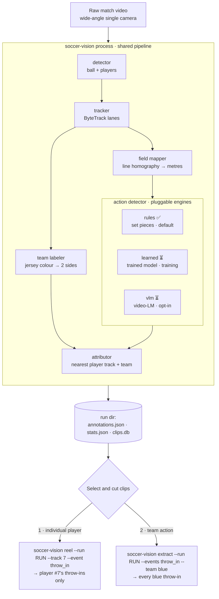

# soccer-vision

Open-source soccer video analysis toolkit. Replicates the useful parts of subscription products (Trace, Veo Editor, LongoMatch) without vendor lock-in — programmatic control over your own match footage.

**For:** coaches, analysts, and developers working with single-camera match video (any fixed/overhead/wide-angle source). Python 3.12+, CPU-viable, no cloud dependency.

Built on [supervision](https://github.com/roboflow/supervision) and the [OSL JSON](https://opensportslab.github.io/opensportslib/data/osl-json-format/) interchange format. Uses transformers-based detection (RF-DETR) — **no Ultralytics/YOLO**.

| Commercial feature | soccer-vision equivalent | Status |
|---|---|---|
| Trace — per-player highlight reels | player tracking + action→player attribution + reels | ✅ track-id based, ⏳ named roster |
| Veo Editor — AI events, team stats | action detector + possession/distance/shot metrics | ✅ rules engine, ⏳ learned engine (training) |
| LongoMatch — manual tagging, playlists | OSL event store + clip DB + contact-sheet review | ✅ CLI, ⏳ desktop GUI |

---

## What's here now

The canonical pipeline runs end to end on CPU. One command turns a raw match into a proxy video, an event stream, team stats, and cut clips:

```bash
soccer-vision process match.mp4
```

Under the hood ([src/soccer_vision/cli/process.py](src/soccer_vision/cli/process.py)):

1. **Load** raw wide-angle video
2. **Virtual broadcast** — follow-cam crop → 16:9 `broadcast_proxy.mp4` (all later steps read the proxy, not the raw file)
3. **Detector** — ball + players per frame (RF-DETR fine-tuned on SoccerNet)
4. **Tracker** — ByteTrack (via supervision); foot positions + jersey-colour samples per track
5. **Field mapper** — line-based homography → pixel-to-metres
6. **Action detector** — pluggable *engines* named by what they do, not the model behind them: `rules` (set pieces, default), `learned` (trained action model, ⏳), `vlm` (video-LM, opt-in). Each action is then **attributed to the nearest player track and their team colour**
7. **Metrics** — distance covered, possession, shots, event counts (overall and per team)
8. **Persist** — SQLite match/event/clip DB + OSL JSON annotations
9. **Clips** — ffmpeg cut per event + contact sheets for review

Every match writes a self-contained run directory:

```
runs/{match_id}/
├── broadcast_proxy.mp4    # 16:9 follow-cam proxy
├── annotations.json       # OSL JSON events (label, frame, team, track_id)
├── stats.json             # team metrics
├── clips/                 # extracted clips
└── sheets/                # contact sheets for human/Claude review
runs/soccer_vision.db      # SQLite across all matches
```

**76 unit tests pass** (OSL round-trip, action detection, possession, attribution, team classification, engine registry, clip math). CI runs ruff + pytest on every PR — no GPU, no model weights.

---

## Two clip workflows: per-player vs team-action

Both share the same `process` run. They only diverge at the **selection** step, where actions (already tagged with `track_id` + `team` by the attributor in step 6) are filtered before cutting.

Every stage below is named for **what it does**. The engine that implements it (RF-DETR, ByteTrack, the trained action model) is a swappable detail — the action detector in particular is a registry of engines you pick by plain name (`--action-engine rules|learned|vlm`), never by model name.



**Action-detection engines** (`--action-engine`, or `action_engines:` in config):

| Engine | Emits | Status |
|---|---|---|
| `rules` | goal kick · corner · throw-in (ball-position heuristics) | ✅ default, always on |
| `learned` | 8 player-attributed actions (pass, drive, cross, shot, header, throw-in, tackle, block) | ⏳ model training; inference engine not wired yet |
| `vlm` | SoccerNet classes via sliding-window video-LM | ⏳ opt-in, weak on youth footage |

The filter (`label` / `team` / `track_id`) is a single shared function ([events/select.py](src/soccer_vision/events/select.py)), so any combination works — a whole team, one player, one action label, or all three at once:

```bash
# 1) Individual player — everything track-id 7 was closest to
soccer-vision reel --run runs/match_001 --track 7 --out player7.mp4

# 2) Team action — all throw-ins by the blue team
soccer-vision extract --run runs/match_001 --events throw_in --team blue

# combine: only #7's throw-ins into one reel
soccer-vision reel --run runs/match_001 --track 7 --event throw_in --out p7_throwins.mp4
```

> **Player identity is track-id based (v1).** A `track_id` is a ByteTrack lane, not yet a named jersey number. Stable per-player identity (jersey OCR / sn-gamestate / SAM3 masklets) is a later phase; `--player <name>` is stubbed until then. Teams are assigned by clustering torso colour into two groups and naming each (blue/white/…), so `--team` works today.

---

## Install

```bash
pip install -e .            # core (CPU)
pip install -e ".[gpu]"     # + SAM3 / GPU inference
pip install -e ".[gui]"     # + desktop reviewer deps (GUI not yet implemented)
pip install -e ".[dev]"     # + pytest, ruff, sphinx
```

**System requirement:** `ffmpeg` on PATH.

```bash
# full pipeline (rules action engine by default)
soccer-vision process match.mp4 [--config examples/process_match.yaml] [--profile examples/profiles/saints-u10.yaml]
# pick action-detection engine(s) explicitly (unavailable engines are skipped)
soccer-vision process match.mp4 --action-engine rules learned
# proxy only
soccer-vision broadcast match.mp4 --out runs/match_001/
# select + cut clips (see workflows above)
soccer-vision extract --run runs/match_001/ --events goal_kick corner_kick
soccer-vision reel    --run runs/match_001/ --event goal_kick --out goal_kicks.mp4
# review / query with Claude (needs ANTHROPIC_API_KEY)
soccer-vision verify  --run runs/match_001/ --profile examples/profiles/saints-u10.yaml
soccer-vision ask "which team had more corners?" --run runs/match_001/
```

---

## Project structure

```
src/soccer_vision/
├── cli/          process · broadcast · extract · reel · verify · ask
├── io/           video (ffmpeg helpers) · osl (JSON 2.0) · project (run dirs)
├── broadcast/    virtual_cam — follow-cam proxy
├── detection/    detector (rfdetr) · ball · field_filter (spectator removal)
├── tracking/     tracker (bytetrack) ✅ · team labeler (teams) ✅ · sam3 ⏳ · gamestate ⏳
├── registration/ field mapper: hough ✅ · sn_calib ⏳ · kpsfr ⏳
├── events/       action detector (sources: rules ✅ · learned ⏳ · vlm ⏳) · set_piece ✅ · phases ✅ · attributor (associate) ✅ · select ✅
├── metrics/      distance · possession · shots · heatmap
├── store/        db (SQLite) + schema.sql
├── clips/        extract (ffmpeg cut) · reels (concat)
├── verify/       sheets (contact sheets) · claude (API) · soccerchat (local VLM, caption/verify only)
├── profiles/     loader (YAML roster / IDP)
└── gui/          ⏳ empty — PySide6 reviewer planned

training/         FOOTPASS.md (player-centric ball-action spotting, primary) ·
                  sn_calib/ (calibration) · sn_spotting/ (T-DEED tackle model) + SLURM sbatch
docs/             Sphinx → Read the Docs
tests/            76 tests + video fixtures
```

`SOCCER_VISION_SPEC.md` is the full architecture spec and phase plan. `CLAUDE.md` documents the older two-script prototypes ([detect_actions.py](detect_actions.py), [extract_clips.py](extract_clips.py), [register.py](register.py)) still usable standalone.

---

## What's left to build

Roughly in priority order:

- **The `learned` action engine** — the biggest gap and the whole point of the current phase. The trained model itself ([`LearnedActionDetector`](src/soccer_vision/events/sources.py) — the `learned` engine) is interface-only: it needs the **inference path** that loads a checkpoint and runs our player tracklets through it to predict actions. Upstream is already built — the model is training on our data, and [scripts/footpass_extract_tracklets.py](scripts/footpass_extract_tracklets.py) turns our own Veo footage into tracklets (detector + tracker + team labeler), smoke-tested on real footage. Remaining: finish the training run, wire the inference engine (`is_available()` flips true once a checkpoint is passed), and improve team/jersey attribution quality. Background: [training/FOOTPASS.md](training/FOOTPASS.md). The `vlm` engine ([verify/soccerchat.py](src/soccer_vision/verify/soccerchat.py)) was evaluated as an alternative and found unreliable as a structured classifier on youth footage — see [training/FOOTPASS_vs_soccerchat.md](training/FOOTPASS_vs_soccerchat.md); kept only as a caption/verification aid (`soccer-vision describe`).
- **Stable player identity** — jersey OCR / sn-gamestate / SAM3 so `--player <name>` resolves to a real roster number instead of a track id ([tracking/sam3.py](src/soccer_vision/tracking/sam3.py), [tracking/gamestate.py](src/soccer_vision/tracking/gamestate.py)).
- **Better field mapper** — neural calibration ([registration/sn_calib.py](src/soccer_vision/registration/sn_calib.py), [registration/kpsfr.py](src/soccer_vision/registration/kpsfr.py)) for footage where field lines are weak.
- **Desktop reviewer** — PySide6 timeline / clip bin / stats tabs ([gui/](src/soccer_vision/gui/) is empty).
- **More action engines / labels** — free kicks, kickoff, substitutions; each is a new engine behind the same `ActionDetector` interface.
- **Packaging** — Read the Docs build, PyPI release, example notebooks.

---

## How to get involved

Early-stage — high-leverage contributions right now:

1. **New action engines** — implement the `ActionDetector` protocol ([events/sources.py](src/soccer_vision/events/sources.py)); it plugs in behind attribution + clip selection with zero downstream changes.
2. **Field mapper for non-broadcast cameras** — improve the line-based fallback or wire a calibration model.
3. **Test fixtures** — short anonymized clips with known actions grow the CI suite.
4. **Try it on your footage** and file issues on detection accuracy — `rules`-engine thresholds are tuned for youth 7v7 (55×36 m field) and need real-world data.

Dev loop: `pip install -e ".[dev]"` → `ruff check src/ tests/` → `pytest -q`. Issues and PRs welcome.

## License

AGPL-3.0-or-later.
