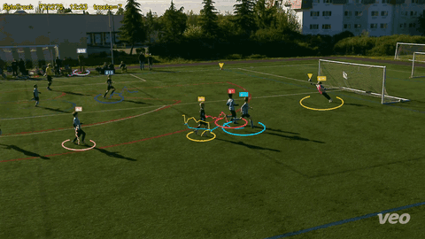
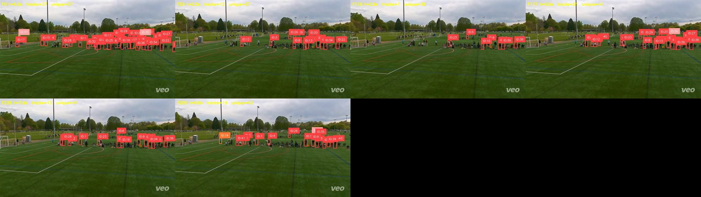
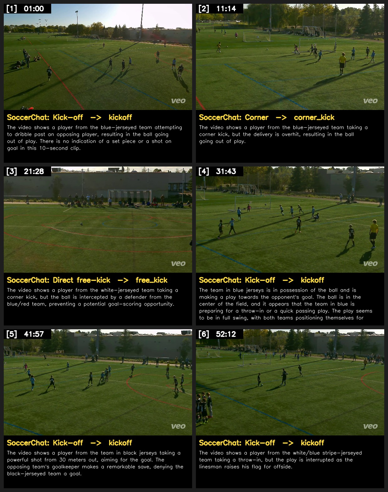
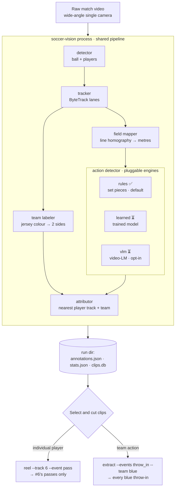

# soccer-vision

**Youth sports video review, from raw match footage to a highlight reel — no subscription.**

Point it at a single-camera match (Veo, overhead, or any fixed wide-angle source)
and ask for the clips you want. Two kinds of request drive everything:

- **Individual actions** — *"every passing action by number 6 on the black team"* → one combined reel.
- **Team actions** — *"all the throw-ins from the blue team"* → one combined reel.

Same pipeline, same filter — pick a player, a team, an action label, or any
combination. An open alternative to Trace / Veo Editor / LongoMatch with
programmatic control over your own footage. Python 3.12+, CPU-viable, no cloud.

```bash
soccer-vision process match.mp4          # detect → track → attribute → store
soccer-vision reel --run runs/match_001 --track 6 --event pass --out number6_passes.mp4
soccer-vision extract --run runs/match_001 --events throw_in --team blue
```

Built on [supervision](https://github.com/roboflow/supervision), RF-DETR
detection, and the [OSL JSON](https://opensportslab.github.io/opensportslib/data/osl-json-format/)
interchange format.

---

## Progress on real youth footage

The perception stack runs end-to-end on our own Veo match footage (CPU-only).

**Detection + tracking on a live shot on goal — RF-DETR labels players, keeper,
referee, and ball; ByteTrack keeps a persistent id on each and traces the run
([full-res clip](docs/images/perception_clip.mp4)):**

[](docs/images/perception_clip.mp4)

**Tracking — ByteTrack gives every player a persistent id (the basis for "number 6"):**



**Action understanding — evaluating models that name the action (set-piece / pass / shot):**



Detection and tracking are solid; per-action attribution is the current focus
(see [What's left](#whats-left)).

---

## What works now

`soccer-vision process match.mp4` turns a raw match into a proxy video, an event
stream, team stats, and cut clips. Under the hood
([cli/process.py](src/soccer_vision/cli/process.py)):

1. **Virtual broadcast** — follow-cam crop → 16:9 `broadcast_proxy.mp4` (all later steps read the proxy)
2. **Detector** — ball + players per frame (RF-DETR fine-tuned on SoccerNet)
3. **Tracker** — ByteTrack lanes; foot positions + jersey-colour samples per track
4. **Team labeler** — cluster torso colour into two sides (blue / white / …)
5. **Field mapper** — line-based homography → pixel-to-metres
6. **Action detector** — pluggable engines (below); each action **attributed to the nearest player track + team**
7. **Metrics** — distance, possession, shots, event counts (overall + per team)
8. **Persist + clips** — SQLite DB, OSL JSON annotations, ffmpeg clips, contact sheets

Every match writes a self-contained run directory:

```
runs/{match_id}/
├── broadcast_proxy.mp4    # 16:9 follow-cam proxy
├── annotations.json       # OSL JSON events (label, frame, team, track_id)
├── stats.json             # team metrics
├── clips/ · sheets/       # extracted clips + review contact sheets
runs/soccer_vision.db      # SQLite across all matches
```

**76 unit tests pass**; CI runs ruff + pytest on every PR — no GPU, no weights.

---

## The two clip workflows

Both share the same `process` run and diverge only at **selection** — actions
(already tagged with `track_id` + `team` in step 6) are filtered before cutting.
The filter is one shared function ([events/select.py](src/soccer_vision/events/select.py)),
so any combination works:

```bash
# Individual player — every action track-id 6 was closest to
soccer-vision reel --run runs/match_001 --track 6 --out number6.mp4

# Team action — all throw-ins by the blue team
soccer-vision extract --run runs/match_001 --events throw_in --team blue

# Combine — only #6's passes, one reel
soccer-vision reel --run runs/match_001 --track 6 --event pass --out number6_passes.mp4
```



**Action-detection engines** (`--action-engine`, or `action_engines:` in config):

| Engine | Emits | Status |
|---|---|---|
| `rules` | goal kick · corner · throw-in (ball-position heuristics) | ✅ default, always on |
| `learned` | 8 player-attributed actions (pass, drive, cross, shot, header, throw-in, tackle, block) | ⏳ model training; inference not wired |
| `vlm` | SoccerNet classes via sliding-window video-LM | ⏳ opt-in, weak on youth footage |

> **Two selection pathways.** *Team-level* filtering works off jersey **colour**
> (`--team black`). *Individual-player* filtering (`--player Simon` / `--number 6`)
> works once you run `soccer-vision identify`, which reads each track's jersey
> number (dedicated recognizer → per-track confidence-weighted vote) into
> `jerseys.json`. A raw `--track 6` still selects a single ByteTrack lane; jersey
> identity unions all lanes carrying that number, so a fragmented player is fully
> selected. On overhead footage some tracks read back `unknown` — fall back to
> `--team` / `--track` there.

---

## Install & run

```bash
pip install -e .            # core (CPU) — also [gpu] / [gui] / [dev] extras
```

Requires `ffmpeg` on PATH.

```bash
soccer-vision process match.mp4 [--config examples/process_match.yaml] [--profile examples/profiles/saints-u10.yaml]
soccer-vision process match.mp4 --action-engine rules learned   # pick engines
soccer-vision broadcast match.mp4 --out runs/match_001/         # proxy only
soccer-vision extract --run runs/match_001/ --events goal_kick corner_kick
soccer-vision reel    --run runs/match_001/ --event goal_kick --out goal_kicks.mp4
soccer-vision verify  --run runs/match_001/ --profile examples/profiles/saints-u10.yaml   # needs ANTHROPIC_API_KEY
soccer-vision ask "which team had more corners?" --run runs/match_001/
```

---

## Project structure

```
src/soccer_vision/
├── cli/          process · broadcast · extract · reel · verify · ask
├── io/           video (ffmpeg) · osl (JSON 2.0) · project (run dirs)
├── broadcast/    virtual_cam — follow-cam proxy
├── detection/    detector (rfdetr) · ball · field_filter (spectator removal)
├── tracking/     tracker (bytetrack) ✅ · team labeler ✅ · sam3 ⏳ · gamestate ⏳
├── registration/ field mapper: hough ✅ · sn_calib ⏳ · kpsfr ⏳
├── events/       action detector (rules ✅ · learned ⏳ · vlm ⏳) · attributor ✅ · select ✅
├── metrics/      distance · possession · shots · heatmap
├── store/        db (SQLite) + schema.sql
├── clips/        extract (ffmpeg cut) · reels (concat)
├── verify/       sheets · claude (API) · soccerchat (local VLM, caption only)
├── profiles/     loader (YAML roster / IDP)
└── gui/          ⏳ empty — PySide6 reviewer planned

training/         FOOTPASS.md (player-centric ball-action spotting) · sn_calib · sn_spotting + SLURM
docs/             images/ + Sphinx → Read the Docs
tests/            76 tests + video fixtures
```

`SOCCER_VISION_SPEC.md` is the full architecture spec. `CLAUDE.md` documents the
older standalone prototypes ([detect_actions.py](detect_actions.py),
[extract_clips.py](extract_clips.py), [register.py](register.py)).

---

## What's left

Roughly in priority order:

- **The `learned` action engine** — the whole point of the current phase, and
  what makes *"#6's passes"* real. [`LearnedActionDetector`](src/soccer_vision/events/sources.py)
  is interface-only; it needs the inference path that loads a checkpoint and runs
  our tracklets through it. Upstream is built — the model is training on our data,
  and [scripts/footpass_extract_tracklets.py](scripts/footpass_extract_tracklets.py)
  turns Veo footage into tracklets. The `vlm` engine
  ([verify/soccerchat.py](src/soccer_vision/verify/soccerchat.py)) was evaluated
  and found unreliable as a structured classifier on youth footage
  ([training/FOOTPASS_vs_soccerchat.md](training/FOOTPASS_vs_soccerchat.md)); kept
  only as a caption aid.
- **Stable player identity across illegible stretches** — `soccer-vision identify`
  reads jersey numbers today (per-track vote → `--player`/`--number`); adding
  re-ID / sn-gamestate / SAM3 would carry identity through frames where the number
  can't be read, so overhead-camera tracks resolve more reliably.
- **Better field mapper** — neural calibration for weak field lines.
- **Desktop reviewer** — PySide6 timeline / clip bin / stats tabs.
- **More action labels** — free kicks, kickoff, substitutions, each a new engine.
- **Packaging** — Read the Docs, PyPI, example notebooks.

---

## Contributing

Early-stage — high-leverage right now: new action engines (implement the
`ActionDetector` protocol in [events/sources.py](src/soccer_vision/events/sources.py)),
a field mapper for non-broadcast cameras, CI test fixtures, and real-footage bug
reports (`rules` thresholds are tuned for youth 7v7, 55×36 m).

Dev loop: `pip install -e ".[dev]"` → `ruff check src/ tests/` → `pytest -q`.

## License

AGPL-3.0-or-later.
