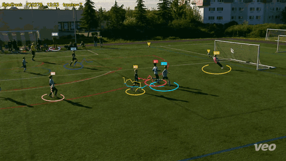

# soccer-vision

**Youth sports video review, from raw match footage to a highlight reel — no subscription.**

Point it at a single-camera match (Veo, overhead, or any fixed wide-angle
source) and ask for the clips you want. Python 3.12+, CPU-viable, no cloud.

📖 **[Full documentation](https://soccer-video-analysis.readthedocs.io)**

```bash
pip install -e .
soccer-vision process match.mp4 --match-id match_001
soccer-vision reel --run runs/match_001 --number 6 --halo --out number6.mp4
```

**Finding and following everyone on the pitch — every player, the keeper, the
referee, and the ball, kept track of frame to frame
([full-res clip](docs/images/perception_clip.mp4)):**

[](docs/images/perception_clip.mp4)

Two kinds of request drive everything:

- **[Individual highlights](https://soccer-video-analysis.readthedocs.io/en/latest/individual-highlights.html)** — *"every touch by number 6"*
- **[Team highlights](https://soccer-video-analysis.readthedocs.io/en/latest/team-highlights.html)** — *"everything the black team did on the ball"*

Selecting by **player** or **team** works today. Selecting by **action label**
(`--events pass`) needs an action detector, which is the piece still being
built — see [Training new detectors](https://soccer-video-analysis.readthedocs.io/en/latest/training-detectors.html).

## What works today

| | Status |
|---|---|
| Finding players, keeper, referee, ball | Works — RF-DETR, F1 0.902 on broadcast benchmark |
| Following them frame to frame | Works — ByteTrack, ids fragment |
| Splitting them onto two teams by kit | Works |
| Cutting one player's on-ball moments | Works — the main pathway |
| Naming a player (jersey OCR / appearance) | Partial — ~34% legible; 42% rank-1 re-ID |
| Naming *what* they did (pass, shot, tackle) | Not yet |
| Where the pitch is | No — [removed, and why](https://soccer-video-analysis.readthedocs.io/en/latest/about.html) |

Every match writes a self-contained run directory:

```
runs/{match_id}/
├── broadcast_proxy.mp4    the video every later step reads
├── tracks.json            where every player was, and which team
├── ball_track.json        where the ball was
├── annotations.json       events (empty until an action detector ships)
├── stats.json             possession and team counts
└── clips/ · sheets/       extracted clips + review contact sheets
```

214 unit tests pass; CI checks every change.

## Docs

| Page | |
|---|---|
| [About](docs/about.md) | the philosophy, and what honestly works |
| [Installation](docs/installation.md) | install, extras, model weights, first run |
| [Individual highlights](docs/individual-highlights.md) | one player's clips |
| [Team highlights](docs/team-highlights.md) | one team's clips |
| [Team profiles](docs/profiles.md) | the squad YAML |
| [Training new detectors](docs/training-detectors.md) | fine-tuning, action models |
| [Contributing](docs/contributing.md) | dev loop, where help is useful |

Build them locally:

```bash
pip install -r docs/requirements.txt
python -m sphinx -b html docs docs/_build/html
```

The full technical architecture lives in `SOCCER_VISION_SPEC.md`, kept separate
so newcomers aren't met with implementation detail up front.

## Project structure

```
src/soccer_vision/     the pipeline itself — capture, track, label, and cut clips
training/              scripts for improving the action-recognition models
docs/                  the documentation above
tests/                 214 tests + video fixtures
```

## Contributing

Early-stage — high-leverage right now: naming same-kit teammates, an action
detector, support for cameras that aren't overhead, and real-footage bug
reports. See [Contributing](docs/contributing.md).

```bash
pip install -e ".[dev]" && ruff check src/ tests/ && pytest -q
```

## License

AGPL-3.0-or-later.
