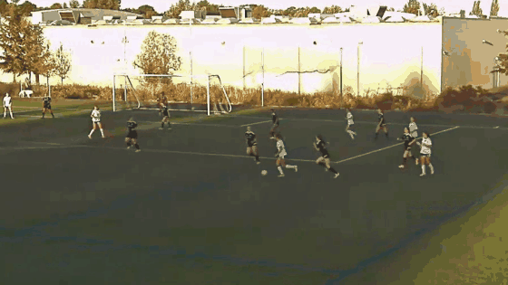
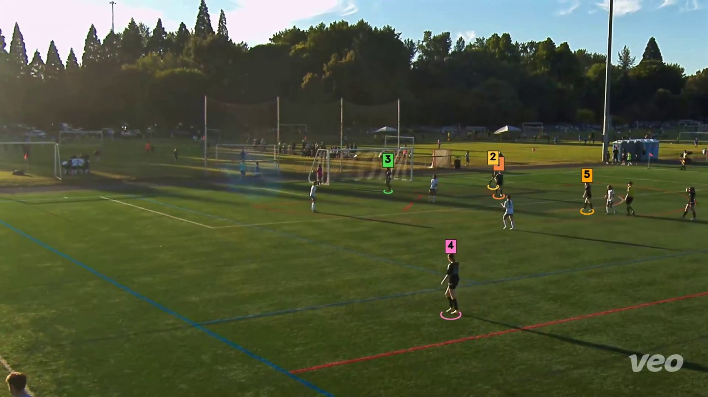

# Individual highlights

*"Every touch by number 6."*



The halo follows the selected player through the clip, including across track-id
handoffs, so a reel of twenty short touches is still watchable.

## The short version

```bash
soccer-vision process match.mp4 --match-id match_001
soccer-vision identify --run runs/match_001 --profile team.yaml
soccer-vision reel --run runs/match_001 --number 6 --halo --out number6.mp4
```

Step 2 is the one that costs you something: the pipeline knows *where* every
player was, but not *who* they are. `identify` puts a name on each track.

## Naming players: two routes

| | Setup | Works when |
|---|---|---|
| **Jersey OCR** | none | the number faces the camera and is big enough |
| **Appearance re-ID** | label your squad once | always — but see the accuracy note |

```bash
# OCR — no setup
soccer-vision identify --run runs/match_001 --profile team.yaml --method ocr

# Appearance — needs a gallery built once (below)
soccer-vision identify --run runs/match_001 --method reid \
    --gallery galleries/northgate-u14.npz --profile team.yaml
```

The default, `--method auto`, uses `reid+ocr` when a gallery is present and
`ocr` otherwise. `reid+ocr` matches on appearance first and sends only the
tracks the gallery *abstained* on to OCR.

Either way, `identify` writes `jerseys.json` with the voted number per track,
its confidence, and `source` (`reid` / `ocr` / `null`) — so which route named a
clip is always auditable.

:::{warning}
**Neither route is solved on overhead footage.** OCR reads a number on ~34% of
crops. Appearance re-ID gets 42% rank-1 naming same-kit teammates — chance is
9%, so there's real signal, but nowhere near enough. Both abstain rather than
guess, so what you get is *correct but incomplete*. Where nothing can name a
player, fall back to `--team` or a raw `--track <id>`.

Re-ID normally separates people by clothing, and teammates wear an identical
kit. At ~53×76 px all that's left is build, hair and gait. This is
[the open problem](contributing.md#where-help-is-most-useful), not a tuning knob.
:::

## Building a gallery

Label your squad once, carry it all season. The highest-yield route shows the
annotator windows of play with every tracked player ringed and numbered — one
decision names an entire track, harvesting every crop in it.



```bash
# 1. Render labelling clips from a processed match
soccer-vision enroll --run runs/match_001 --dump-tracklets runs/match_001/tracklets \
    --profile team.yaml --team black --window 20 --n-windows 8

# 2. Label in Label Studio on your laptop, drop the export back beside the manifest

# 3. Enrol
soccer-vision enroll --run runs/match_001 \
    --from-tracklets runs/match_001/tracklets/annotations.json \
    --out galleries/northgate-u14.npz --append
```

:::{note}
**Video walkthrough of step 2 — <!-- LOOM: paste the share link here -->coming
soon.** Setting up the Label Studio project and labelling a first window is the
part that's fiddly to describe in text.
:::

There is a second route that needs **no processed run at all** — it detects on
a couple of dozen exported frames and nothing else, so a squad you have never
processed can be labelled straight off the raw file in seconds:

```bash
soccer-vision enroll --video data/match.mp4 --dump-frames label_frames/ \
    --profile team.yaml --n-frames 24
# label, then:
soccer-vision enroll --from-label-studio label_frames/annotations.json \
    --profile team.yaml --out galleries/northgate-u14.npz
```

Labelling happens on the **full frame**, not on a cropped thumbnail. An overhead
camera renders a player at about 50×21 px — unnameable in isolation at any zoom,
but easy on the frame where you have position, neighbours and direction of play.

:::{tip}
**Spread beats length.** A 1.4-second track is one pose in one light. Eight
windows across a whole match teaches the gallery far more than one long window
— we measured 260 crops from a single 3-minute stretch making *no* measurable
difference. Top up with `--append` after each match, and enrol both kits if your
team has a home and an away strip.
:::

## What "on the ball" actually means

There is no pass detector yet, so `--number 6` matches nothing in the event
stream. Rather than returning an empty reel, `extract` and `reel` fall back to
**on-ball spans** — the stretches where that player was within `--on-ball-dist`
pixels (default 90) of the ball.

This is proximity, not action recognition. It finds when #6 *had* the ball, not
that #6 *passed*.

Two deliberate limits:

- **It won't fire when you asked for a label.** `--events pass` returning
  ball-proximity touches would answer a different question. Force it with
  `--on-ball`, disable it entirely with `--no-on-ball`.
- **It won't fire without a player selection.** `--team blue` alone has no lane
  to anchor spans on.

A span opens when the player is *near* the ball, not only when they are the
closest player on the pitch — requiring nearest silently dropped every tackle,
challenge and press, which is exactly the footage people want.

## Options worth knowing

| Flag | Default | Effect |
|---|---|---|
| `--halo [ellipse\|circle]` | off | spotlight the selected player |
| `--on-ball-dist PX` | 90 | how close counts as on the ball |
| `--on-ball-min-span SEC` | 0.4 | drop shorter spans as incidental |
| `--team COLOUR` | — | restrict to when they played for that side |
| `--player NAME` | — | needs `identify` + a [profile](profiles.md) |

`reel` sizes each clip to the span's real duration, so a 1-second touch and a
40-second dribble don't produce the same footage.
