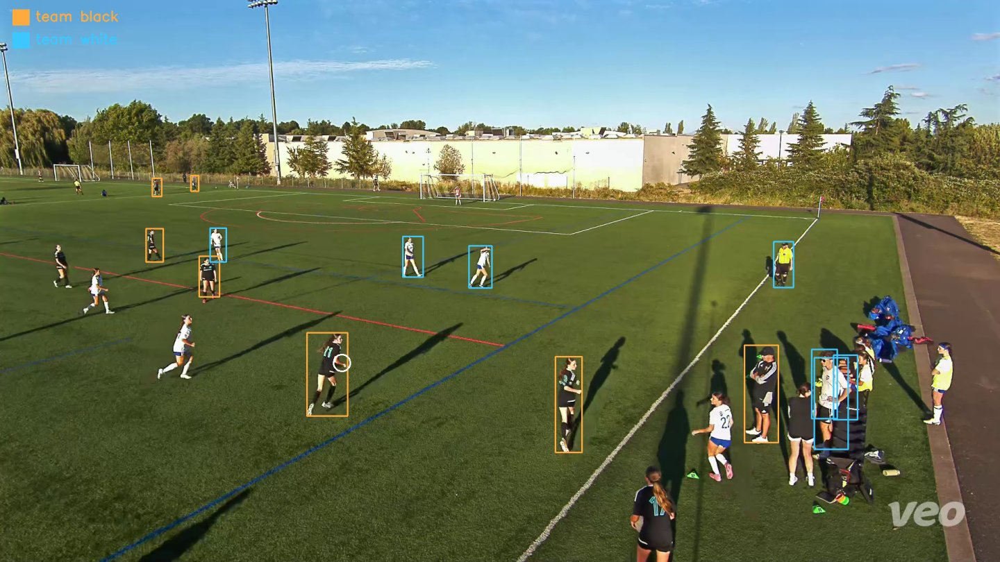
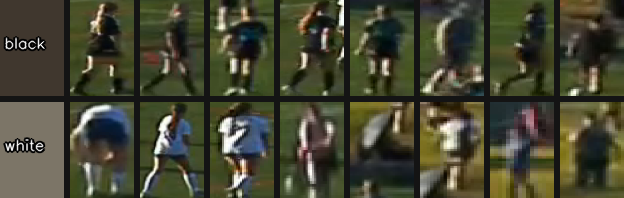

# Team highlights

*"Everything the black team did on the ball."*



Team-level clips need **no annotation and no `identify` step**. `process`
already sorts every track onto one of two sides by kit colour, so you can go
straight from a raw match to a reel.

*(Note the substitutes on the touchline at right, also boxed and assigned. The
on-field cut is a single horizontal line across the top of the frame, so it
removes rooftops and trees but not people standing beside the pitch — see
[Contributing](contributing.md#where-help-is-most-useful).)*

```bash
soccer-vision process match.mp4 --match-id match_001
soccer-vision reel --run runs/match_001 --team black --out black_team.mp4
```

## Checking the split first

`process` writes `teams_preview.png` — a sample of the crops it assigned to each
side. Look at it before you cut anything; a bad split is obvious in two seconds
and invisible in a 40-minute reel.



It also prints which route it used, as `Team split by:`.

## Why kit colour is harder than it sounds

The naive approach — average the pixels in each player's box and cluster — gets
this badly wrong outdoors. On our own footage it stamped **624 tracks `black`
against 38 `white`**, and every kit-aware query was simply wrong.

Two things were going on:

1. **Turf contamination.** A bounding box is not a player; it's a player plus
   grass and shadow. Fixed by rejecting grass-hued pixels inside the torso
   window. Real, but the minor part.
2. **Shadow.** Under a low sun the local turf ranges over L\* 50–101, so **a
   white kit in shade is darker than a black kit in sun.** No amount of turf
   rejection helps — absolute lightness is not a property of the kit.

The fix is to judge each player against the grass they are standing on. A dark
kit reflects less than that grass, a light kit more, so the *sign* of
torso-minus-turf lightness names the side. That gave **419 black / 243 white**
where the old path gave 624/38.

:::{note}
**Clustering cannot find this boundary — don't try.** The relative-lightness
histogram is unimodal with a long sunlit-white tail; the two kits abut rather
than separate. Both k-means and Otsu cut in the wrong place, isolating 12 bright
shirts out of 188. Zero is the boundary for a physical reason, not a statistical
one.

This route only applies when the two declared kits **straddle** the turf in
lightness — black/white and blue/white qualify, red/blue does not. For those,
the code falls back to colour clustering, where hue separates them cleanly.
:::

Declare your kits in a [profile](profiles.md) so `process` knows which route to
take, and so `--team black` means something rather than being guessed.

## Cutting the clips

```bash
# Whole team, one reel
soccer-vision reel --run runs/match_001 --team black --out black_team.mp4

# Individual clips instead of a concatenated reel
soccer-vision extract --run runs/match_001 --team black --pre 2 --post 5

# Compose with a player — #6's moments, only while playing for black
soccer-vision extract --run runs/match_001 --number 6 --team black
```

:::{warning}
`--team` on its own filters the **event stream**, and no action detector ships
today — so `annotations.json` is empty and a team-only query returns nothing.
The on-ball fallback deliberately does not fire here: a whole team has no single
track to anchor spans on.

Until an action detector lands, the working team pathway is to compose `--team`
with a player selection (as in the third example above), or use
[`trim-empty`](#trimming-dead-time) to cut the match down to live play.
:::

## Trimming dead time

Youth matches are mostly dead time. `trim-empty` removes spans where the ball is
offscreen or not moving, splicing the rest into a new file. **The original is
never modified.**

```bash
# Build a ball track and trim in one go
soccer-vision trim-empty match.mp4 --save-track ball_track.json

# Preview the cut list without rendering
soccer-vision trim-empty match.mp4 --track ball_track.json --dry-run
```

Writes `match.trimmed.mp4` plus `match.trim.json`, an edit-decision list
recording every kept and removed span and why.

| Flag | Default | Effect |
|---|---|---|
| `--min-dead SEC` | 5 | how long dead before it's cut |
| `--stationary-px PX` | 40 | drift that still counts as "not moving" |
| `--pad SEC` | 0.5 | context kept around each cut |
| `--no-smooth` | off | skip Kalman smoothing of the ball track |

Auto-built tracks are sampled at 15 fps and Kalman-smoothed, because the ball
detector flickers — it latches onto a jersey number for a frame and the reported
position teleports and snaps back. The filter gates those jumps out and coasts
on its prediction instead. At 5 fps the ball genuinely moves too far between
samples for the gate to tell real motion from a false positive, and it
over-rejects; 15 fps is the working default.
