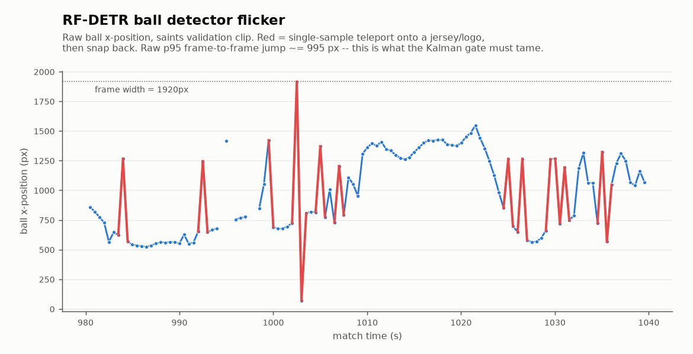

# Training new detectors

Two models sit under the highlight pages, and they need very different work.

| | Ships today | The lever |
|---|---|---|
| **Detector** — finds players and the ball | RF-DETR, F1 0.902 on broadcast | fine-tune on *your* footage |
| **Action model** — names pass, shot, tackle | nothing | train one; the seam is already there |

## Fine-tuning the detector

RF-DETR (`julianzu9612/RFDETR-Soccernet`) is already a SoccerNet fine-tune, so it
handles broadcast angles well. Overhead and Veo footage is a different domain,
and that's where fine-tuning pays.

The training data is already a by-product of teaching it your squad: every
labelled frame from `soccer-vision enroll --dump-frames` is a frame with named,
box-annotated players on your own camera.

```bash
soccer-vision enroll --video data/match.mp4 --dump-frames label_frames/ --n-frames 24
# label in Label Studio, then feed the export to rfdetr's train()
```

Two measured weaknesses worth targeting, both on a 3-minute overhead clip:

**Ball jitter.** 84.5% of frames get a ball, but the median frame-to-frame jump
is 54 px and the **p95 is 905 px** on a 1920 px-wide frame — the detector latches
onto a jersey number or a sponsor logo for a frame and snaps back.



*(Chart is a different clip — our validation footage, p95 ~995 px — but
the failure mode is the same on every video we've measured.)*

A Kalman smoother (`soccer_vision.tracking.ball_kalman`) already fixes most of
this and is wired into `trim-empty` — but **not** into `process`, so on-ball
spans inherit the raw jitter. Wiring it in is a contained, useful contribution.

**Track fragmentation.** 856 track lanes in three minutes, median lane length
1.4 seconds, only 32 lanes reaching 50 frames. One player becomes many lanes.
`enroll`/`identify` paper over this by merging lanes per player; fixing it at the
tracker would help everything downstream.

`optimize_for_inference(dtype=float16)` is an untouched speed lever — the
benchmark numbers above are all unoptimized.

## Training an action model

This is the open piece. `annotations.json` comes out empty on every run because
no action detector ships.

**The target is FOOTPASS / SN-PCBAS-2026** — player-centric ball-action spotting,
where every event is `(frame, team, jersey, class)` across 8 classes: pass,
drive, cross, shot, header, throw-in, tackle, block. Per-event attribution is
native, which is exactly what the clip selector needs. See
[`training/FOOTPASS.md`](https://github.com/bw4sz/soccer-video-analysis/blob/master/training/FOOTPASS.md).

The reference architecture is **TAAD** — an X3D-S video backbone
(Kinetics-pretrained) with `roi_align` over per-player tracklets. Data is 54
matches / 102,992 events on HuggingFace (`SoccerNet/SN-PCBAS-2026`, gated but
auto-approved).

```bash
sbatch training/slurm/train_footpass_taad.sbatch
```

### How a trained model plugs in

Nothing downstream needs to change. Action detectors implement one Protocol in
`soccer_vision.events.sources`:

```python
class ActionDetector(Protocol):
    name: str
    def is_available(self) -> bool: ...          # weights present, deps installed
    def detect(self, ctx: ActionContext) -> list[dict]: ...
```

Return `{label, frame, timestamp_s, confidence}` dicts. Player and team
attribution is added afterwards by `events/associate.py`, and clip selection is
label-agnostic — so `--events pass` starts working the moment `is_available()`
returns `True`.

Two engines are declared: `learned` (interface only, awaiting a checkpoint) and
`vlm` (a video language model as a sliding-window spotter, opt-in). Select with
`--action-engine`.

:::{warning}
**A third engine, `rules`, was retired — don't rebuild it.** It detected set
pieces from the ball's position in field metres, and those metres came from a
homography that does not work on this footage. It didn't fail quietly: one run
emitted 236 events that were 100% `throw_in` and 100% false, which propagated
into clips, contact sheets, and pre-filled Label Studio predictions. Naming
`rules` now raises rather than returning an empty list.

Set-piece spotting should come back through `learned`, or from pixel-space zones
anchored on a turf mask — not from a metric test over an unvalidated homography.
:::

## Getting training data

**Your own footage, labelled.** `soccer-vision annotate` builds a Label Studio
project where you confirm or correct the pipeline's label on each clip. Those
corrections are the training set that teaches it youth footage.

**Breadth from YouTube.** `harvest` pulls short, openly-licensed youth clips —
many cameras, countries and kit colours — so an annotation set isn't deep on one
team and one camera.

```bash
pip install -e ".[harvest]"
soccer-vision harvest --dry-run -n 200                 # preview yield
soccer-vision harvest --out-dir data/youth_clips -n 200  # resumable
```

Only videos the uploader released under **Creative Commons Attribution** are
kept, and every clip's provenance is logged to `manifest.jsonl` and
`ATTRIBUTION.md` — a CC BY duty. Note that downloading from YouTube is contrary
to its ToS even for CC-BY content; CC BY covers content *reuse*, not retrieval.
Keep the attribution manifest with any release.

## Validating before you trust it

For player identity, `slurm/validate_reid.py` does leave-one-track-out and
`slurm/validate_reid_frames.py` does the harder leave-one-**frame**-out — build
the gallery from the rest of the match, then name a player in a frame they were
not enrolled from. Always run the frame version on a new venue before relying on
a gallery.

Keep galleries side by side (`*.frames-only.npz`, `*.with-tracklets.npz`) and
A/B any new batch of annotation on a fixed held-out set. We did this and found
that 260 new crops made **no measurable difference**, which saved a lot of
pointless labelling.
